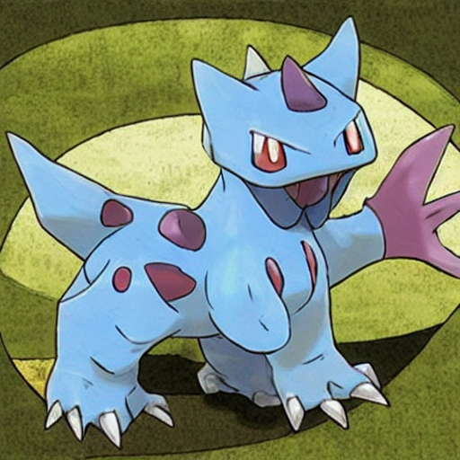
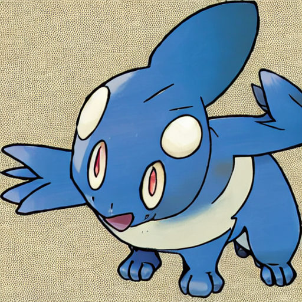
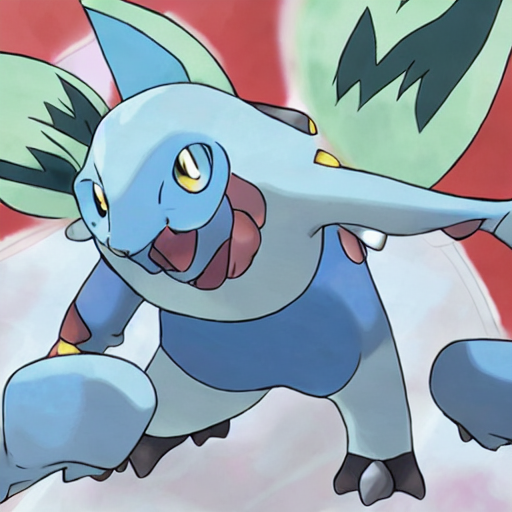

---
license: creativeml-openrail-m
base_model: runwayml/stable-diffusion-v1-5
tags:
- stable-diffusion
- stable-diffusion-diffusers
- text-to-image
- diffusers
- lora
inference: true
---
    
# LoRA text2image fine-tuning - starsdeep/pokemon-lora
These are LoRA adaption weights for runwayml/stable-diffusion-v1-5. The weights were fine-tuned on the lambdalabs/pokemon-blip-captions dataset. You can find some example images in the following. 

